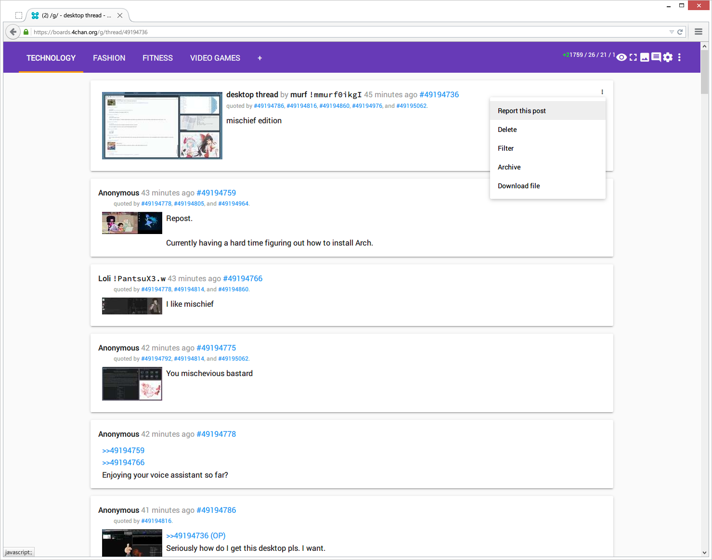

#xl.css
####*Sort of like [Medium](https://medium.com/), but not as tight.*

#JULY 2015 UPDATE
Ever since Mayhem stopped working on 4chan X, I guess I gave up on this style. Pretty sure it uses all the old classes so it won't really work with ccd0's version and would require a bit of changing.

I'll leave it here for archive's sake. However, a new version is being worked on.



Honestly, not very usable in its current state.

Again, you're going to have to block the default stylesheets using the method from collabstyle, and then you'll also need `xl.user.js` to add a pinch of rice.

####Stuff You Need

Currently only Firefox is supported, as this userstyle uses CSS variables, which __ARE NOT__ supported officially yet.

AdBlock Plus filters like this:

(add-ons > adblock plus > options > filter preferences > custom filters tab)

```
*//s.4cdn.org/image/title/*
*//s.4cdn.org/css/*
*//s.4cdn.org/js/prettify/prettify.*.css
*//pixel.quantserve.com/*
```

#JANUARY 2016 UPDATE
After upgrading to Windows 10 last year, I decided to give up on Firefox and move to Chrome as my main browser of choice. So, I had to update `xl.css` accordingly. Still not complete. Everytime I start working on it, I either want to create a whole new style again (which I am) or just lose interest straight away because at the moment, it works for me. Ideally I would like to support all 4chan X features, and also have both Firefox and Chrome support, as was my original goal with my userstyles from *2009*. God damn, 6 years of this shit?
